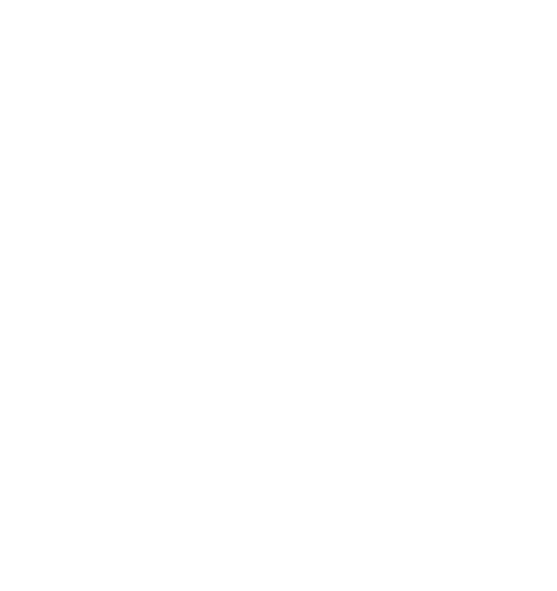
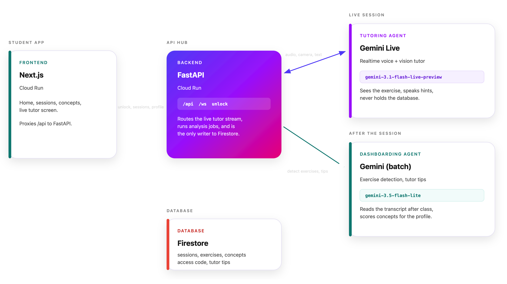

<p align="center">
  
</p>

[](https://www.youtube.com/watch?v=46OxPEXMIMY&t=1s)
[](https://compass-frontend-267298975923.us-central1.run.app/)


The screenless AI tutor that helps students think, focus, and find their own way.

## Description

Compass is a screenless AI tutor designed to help students learn, stay focused, and build confidence—all without the distractions of a screen. Through the use of both conversational AI and vision, Compass can observe what the student is doing and provide real-time guidance and explanations. Importantly, the agent never simply gives away the answers; instead, it supports students in discovering solutions for themselves, fostering deeper understanding and independence.

Alongside the main tutor agent, Compass uses a second agent dedicated to analyzing learning patterns and statistics. This second agent observes progress over time and offers personalized tips to help each student improve more effectively. Together, these agents create a natural, interactive, and adaptive learning environment—empowering students to progress at their own pace and in their own way.

## Architecture

<p align="center">
  
</p>


## Quick start

**Backend**:

Copy `backend/.env.example` to `backend/.env`.

Required: `GEMINI_API_KEY` and `FIRESTORE_PROJECT` (your GCP project id).

```bash
cp backend/.env.example backend/.env   # add GEMINI_API_KEY and FIRESTORE_PROJECT
```

```bash
cd backend
uv pip install -r requirements.txt
uv run python main.py
```

**Frontend:**

```bash
cd frontend
npm install
npm run dev -- --hostname 0.0.0.0 --experimental-https
```

- UI: https://localhost:3000
- API: http://localhost:8000

## Docker

```bash
docker compose up --build
```

Images and env vars: [backend/README.md](backend/README.md) and [frontend/README.md](frontend/README.md).

## Acknowledgements

Compass is based on the [gemini-live sample repository](https://github.com/google-gemini/gemini-live-api-examples). We would like to thank its authors and maintainers for their foundational work and inspiration.

This project was developed specifically for the All Things Agentic Hackathon, organized by Google. #AllThingsAgenticHackathon


